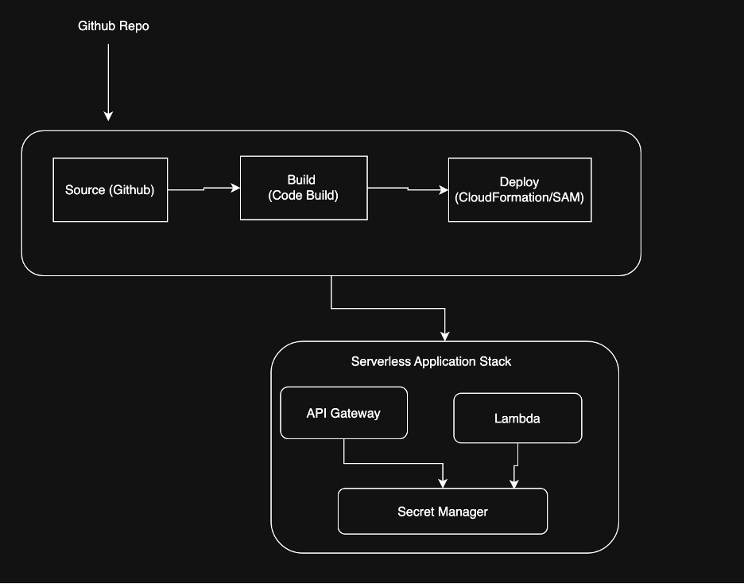
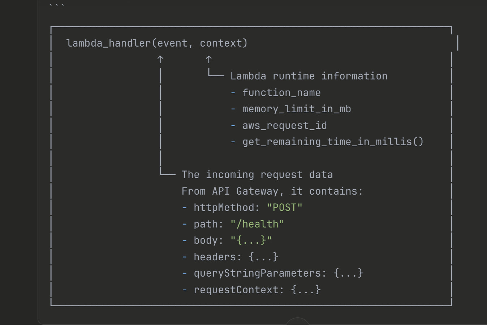

# Pipeline 

pipeline-stack.yml - Main CloudFormation template that creates:
CodePipeline with 5 stages (Source, Validation, Dev Deploy)
3 CodeBuild projects for validation and deployment
S3 artifact bucket with cross-account access
IAM roles and policies


cross-account-role.yml - IAM role template for Dev and Test accounts to allow cross-account deployments

buildspec-deploy.yml - CodeBuild specification that packages Lambda functions and deploys CloudFormation stacks

deploy-pipeline.sh - Interactive bash script for easy pipeline deployment

dev-params.json & test-params.json - Environment-specific configuration parameters

# ###############################################################################

Objective
Design and implement a CI/CD pipeline using AWS CodePipeline and CloudFormation (with AWS SAM) that provisions and deploys a simple serverless application.
You will build a CodePipeline with three stages:
• Source
• Build
• Deploy

The pipeline must deploy a serverless REST API composed of:
• AWS Lambda
• AWS Secrets Manager
• Amazon API Gateway (REST API)

All infrastructure must be defined using CloudFormation and AWS SAM.
Manual resource creation via the AWS Console is not allowed.

Functional Requirements

1. Source Stage
•	Source code must be hosted in GitHub
•	The pipeline must pull code using CodeStar Connections
•	Branch selection must be configurable (for example: dev)
2. Build Stage
•	Use AWS CodeBuild
•	The build stage must:
I.	Package CloudFormation/SAM templates
II.	Upload artifacts to S3
III.	Produce a packaged template ready for deployment
• A buildspec.yml file is required
• The build must fail clearly if packaging or validation fails

3. Deploy Stage
•	Use AWS CloudFormation to deploy resources
•	The deploy stage must create or update a CloudFormation stack
•	Stack updates must be idempotent

Serverless Application Requirements
AWS Lambda
•	Runtime: Python 3.12
•	A simple handler that:
–	Reads a secret from AWS Secrets Manager
–	Returns a JSON response
•	Proper IAM permissions must be defined using least privilege

AWS Secrets Manager
•	A secret must be created via CloudFormation
•	The Lambda function must reference the secret using:
–	Environment variables
–	IAM permissions (no hard-coded values)
API Gateway (REST API)
•	Must be created using AWS SAM
•	Must expose at least one endpoint:
–	Method: POST
–	Path: /health or /test
•	API Gateway must integrate with the Lambda function
•	Lambda proxy integration is acceptable


Infrastructure as Code Requirements
•	All resources must be defined using:
–	AWS CloudFormation
–	AWS SAM (Transform: AWS::Serverless-2016-10-31)
•	Nested stacks are allowed but not required
•	Parameters must be used for:
–	Environment name
–	Application name
•	Templates must be deployable using aws cloudformation package and deploy
•	
Repository Structure (Suggested)
.
├── cloudformation/
│   ├── pipeline.yaml
├── lambda/
│   └── app.py
├── buildspec.yml
├── serverless-app-template.yaml
└── <env>.json

Security & Best Practices
•	No secrets committed to GitHub
•	IAM roles must follow least privilege
•	Hard-coded ARNs should be avoided
•	CloudFormation parameters should be used appropriately
•	Clear separation between pipeline infrastructure and application infrastructure

Deliverables
GitHub repository containing:
• CloudFormation templates
• SAM templates
• Lambda code
• buildspec.yml
• Environment-specific parameter file
The solution must deploy successfully resources mentioned above in a same AWS account

#########################################

## Architecture 
 
 

## ARN Connection




## Response body
{
  "status": "healthy",
  "message": "Service is running",
  "timestamp": "2024-01-15T10:30:45.123456+00:00",
  "environment": "dev",
  "application": "serverless-app",
  "request_id": "abc123-def456",
  "secret_config": {
    "app_name": "serverless-app",
    "environment": "dev",
    "api_key_present": true    // ← Boolean, NOT the actual key!
  }
}

## Complete Flow Diagram
```
┌─────────────────────────────────────────────────────────────────────────────┐
│                         LAMBDA EXECUTION FLOW                                │
└─────────────────────────────────────────────────────────────────────────────┘

     CLIENT                    API GATEWAY                    LAMBDA
        │                          │                            │
        │  POST /health            │                            │
        │─────────────────────────>│                            │
        │                          │                            │
        │                          │  Invoke Lambda             │
        │                          │  event = {                 │
        │                          │    "httpMethod": "POST",   │
        │                          │    "path": "/health",      │
        │                          │    ...                     │
        │                          │  }                         │
        │                          │───────────────────────────>│
        │                          │                            │
        │                          │              ┌─────────────┴─────────────┐
        │                          │              │  lambda_handler(event,    │
        │                          │              │                context)   │
        │                          │              │                           │
        │                          │              │  1. Log event             │
        │                          │              │  2. Extract path, method  │
        │                          │              │  3. Call get_secret()     │
        │                          │              │     └─> Secrets Manager   │
        │                          │              │  4. Build response_body   │
        │                          │              │  5. Return response       │
        │                          │              └─────────────┬─────────────┘
        │                          │                            │
        │                          │  Response:                 │
        │                          │  {                         │
        │                          │    "statusCode": 200,      │
        │                          │    "body": "{...}"         │
        │                          │  }                         │
        │                          │<───────────────────────────│
        │                          │                            │
        │  HTTP 200 OK             │                            │
        │  {"status": "healthy"}   │                            │
        │<─────────────────────────│                            │
        │                          │                            │

```

### SAM Transform
```
┌─────────────────────────────────────────────────────────────────────────────┐
│  Transform: AWS::Serverless-2016-10-31                                       │
│                                                                             │
│  This is the MAGIC that makes SAM work!                                     │
│                                                                             │
│  What it does:                                                              │
│  1. Tells CloudFormation to use the SAM preprocessor                        │
│  2. Enables simplified resource types like:                                 │
│     - AWS::Serverless::Function (instead of AWS::Lambda::Function)         │
│     - AWS::Serverless::Api (instead of AWS::ApiGateway::RestApi)           │
│                                                                             │
│  Behind the scenes, SAM Transform converts:                                 │
│                                                                             │
│  AWS::Serverless::Function  ──────►  AWS::Lambda::Function                  │
│                                      AWS::Lambda::Permission                │
│                                      AWS::IAM::Role (if not provided)      │
│                                                                             │
│  AWS::Serverless::Api       ──────►  AWS::ApiGateway::RestApi              │
│                                      AWS::ApiGateway::Stage                │
│                                      AWS::ApiGateway::Deployment           │
│                                      + many more resources                 │
└─────────────────────────────────────────────────────────────────────────────┘


┌─────────────────────────────────────────────────────────────────────────────┐
│  Parameters are INPUT VARIABLES for your template                           │
│                                                                             │
│  They allow you to:                                                         │
│  1. Reuse the same template for different environments                      │
│  2. Customize deployments without changing the template                     │
│  3. Pass values at deploy time                                              │
│                                                                             │
│  Usage when deploying:                                                      │
│  aws cloudformation deploy \                                                │
│    --parameter-overrides \                                                  │
│      EnvironmentName=prod \        ← Overrides default "dev"               │
│      ApplicationName=my-app \      ← Overrides default "serverless-app"    │
│      LogRetentionDays=30           ← Overrides default 14                  │
└─────────────────────────────────────────────────────────────────────────────┘

```
┌─────────────────────────────────────────────────────────────────────────────┐
│  Environment Variables = Configuration passed to Lambda                     │
│                                                                             │
│  These become available in your Python code via os.environ:                │
│                                                                             │
│  YAML:                              Python:                                 │
│  SECRET_ARN: !Ref ApplicationSecret │ os.environ.get("SECRET_ARN")         │
│                                     │ → "arn:aws:secretsmanager:..."       │
│                                     │                                       │
│  SECRET_NAME: !Sub ...              │ os.environ.get("SECRET_NAME")        │
│                                     │ → "serverless-app/dev/app-secret"    │
│                                     │                                       │
│  ENVIRONMENT: !Ref EnvironmentName  │ os.environ.get("ENVIRONMENT")        │
│                                     │ → "dev"                              │
│                                     │                                       │
│  APPLICATION_NAME: !Ref ...         │ os.environ.get("APPLICATION_NAME")   │
│                                     │ → "serverless-app"                   │
└─────────────────────────────────────────────────────────────────────────────┘


## why use Environment Variables?**

┌─────────────────────────────────────────────────────────────────────────────┐
│  ✓ DO: Use environment variables                                            │
│    - Configuration is separate from code                                    │
│    - Same code works in dev/staging/prod                                   │
│    - Easy to change without redeploying code                               │
│                                                                             │
│  ✗ DON'T: Hard-code values in Python                                       │
│    # Bad!                                                                   │
│    SECRET_NAME = "serverless-app/dev/app-secret"  ← Hard-coded            │
│                                                                             │
│    # Good!                                                                  │
│    SECRET_NAME = os.environ.get("SECRET_NAME")    ← From environment       │
└─────────────────────────────────────────────────────────────────────────────┘


### Events (API Gateway Triggers) Explained
```
┌─────────────────────────────────────────────────────────────────────────────┐
│  Events define WHAT TRIGGERS the Lambda function                            │
│                                                                             │
│  This creates 3 triggers:                                                   │
│                                                                             │
│  ┌─────────────────────────────────────────────────────────────────────┐   │
│  │  Event Name    │  Method  │  Path    │  Full URL                    │   │
│  ├────────────────┼──────────┼──────────┼──────────────────────────────┤   │
│  │  HealthPost    │  POST    │  /health │  POST https://xxx.../health  │   │
│  │  HealthGet     │  GET     │  /health │  GET  https://xxx.../health  │   │
│  │  TestPost      │  POST    │  /test   │  POST https://xxx.../test    │   │
│  └─────────────────────────────────────────────────────────────────────┘   │
│                                                                             │
│  RestApiId: !Ref ApiGateway                                                │
│  └── Links these events to our API Gateway resource                        │
│                                                                             │
│  Behind the scenes, SAM creates:                                           │
│  1. API Gateway Method for each event                                      │
│  2. API Gateway Integration (Lambda proxy)                                 │
│  3. Lambda Permission (allows API Gateway to invoke Lambda)                │
└─────────────────────────────────────────────────────────────────────────────┘
```

**Request Flow:**
```
┌─────────────────────────────────────────────────────────────────────────────┐
│                                                                             │
│   Client                API Gateway              Lambda                     │
│     │                       │                      │                        │
│     │  POST /health         │                      │                        │
│     │──────────────────────►│                      │                        │
│     │                       │  Invoke              │                        │
│     │                       │─────────────────────►│                        │
│     │                       │                      │  lambda_handler()      │
│     │                       │                      │  path == "/health"     │
│     │                       │                      │  method == "POST"      │
│     │                       │◄─────────────────────│                        │
│     │  200 OK               │  Response            │                        │
│     │◄──────────────────────│                      │                        │
│     │                       │                      │                        │
│                                                                             │
└─────────────────────────────────────────────────────────────────────────────┘


┌─────────────────────────────────────────────────────────────────────────────┐
│  !Sub performs multiple substitutions:                                       │
│                                                                             │
│  ${ApiGateway}     → API Gateway ID (e.g., "abc123xyz")                    │
│  ${AWS::Region}    → Current region (e.g., "us-east-1")                    │
│  ${EnvironmentName}→ Parameter value (e.g., "dev")                         │
│                                                                             │
│  Result:                                                                    │
│  https://abc123xyz.execute-api.us-east-1.amazonaws.com/dev                 │
│          ↑                     ↑                       ↑                   │
│          │                     │                       └── Stage           │
│          │                     └── Region                                   │
│          └── API Gateway ID                                                 │
└─────────────────────────────────────────────────────────────────────────────┘
```

---

## Intrinsic Functions Summary

| Function | Syntax | Purpose | Example |
|----------|--------|---------|---------|
| `!Ref` | `!Ref ResourceName` | Get resource ID/name or parameter value | `!Ref EnvironmentName` → `"dev"` |
| `!Sub` | `!Sub ${Variable}` | String substitution | `!Sub ${AppName}-api` → `"myapp-api"` |
| `!GetAtt` | `!GetAtt Resource.Attribute` | Get resource attribute | `!GetAtt Role.Arn` → `"arn:aws:iam::..."` |
| `!Join` | `!Join [delimiter, [values]]` | Join strings | `!Join ["-", ["a", "b"]]` → `"a-b"` |
| `!If` | `!If [condition, true, false]` | Conditional value | `!If [IsProd, "large", "small"]` |

---

## Complete Resource Diagram
```
┌─────────────────────────────────────────────────────────────────────────────┐
│                         RESOURCES CREATED                                    │
└─────────────────────────────────────────────────────────────────────────────┘

┌─────────────────────────────────────────────────────────────────────────────┐
│                                                                             │
│   ┌────────────────────┐                                                   │
│   │  ApplicationSecret │  AWS::SecretsManager::Secret                      │
│   │                    │  serverless-app/dev/app-secret                    │
│   └─────────┬──────────┘                                                   │
│             │                                                               │
│             │ !Ref (provides ARN)                                          │
│             ▼                                                               │
│   ┌────────────────────┐      ┌─────────────────────┐                      │
│   │ LambdaExecutionRole│      │ HealthCheckLogGroup │                      │
│   │                    │      │                     │                      │
│   │  IAM Role with:    │      │  CloudWatch Logs    │                      │
│   │  - CloudWatch Logs │      │  14 day retention   │                      │
│   │  - Secrets Manager │      │                     │                      │
│   └─────────┬──────────┘      └──────────┬──────────┘                      │
│             │                            │                                  │
│             │ !GetAtt Arn                │ LogGroupName references          │
│             ▼                            ▼                                  │
│   ┌─────────────────────────────────────────────────┐                      │
│   │           HealthCheckFunction                    │                      │
│   │                                                  │                      │
│   │  AWS::Serverless::Function                      │                      │
│   │  - Handler: app.lambda_handler                  │                      │
│   │  - Runtime: python3.12                          │                      │
│   │  - Environment variables                        │                      │
│   └─────────────────────┬───────────────────────────┘                      │
│                         │                                                   │
│                         │ Events                                            │
│                         ▼                                                   │
│   ┌─────────────────────────────────────────────────┐                      │
│   │              ApiGateway                          │                      │
│   │                                                  │                      │
│   │  AWS::Serverless::Api                           │                      │
│   │  - Stage: dev                                   │                      │
│   │  - Endpoints:                                   │                      │
│   │    POST /health                                 │                      │
│   │    GET  /health                                 │                      │
│   │    POST /test                                   │                      │
│   └─────────────────────────────────────────────────┘                      │
│                                                                             │
└─────────────────────────────────────────────────────────────────────────────┘
```

---

## Quick Reference Card
```
┌─────────────────────────────────────────────────────────────────────────────┐
│  SERVERLESS-APP-TEMPLATE.YAML QUICK REFERENCE                               │
├─────────────────────────────────────────────────────────────────────────────┤
│                                                                             │
│  Parameters (inputs):                                                       │
│  - EnvironmentName: dev/staging/prod                                       │
│  - ApplicationName: app name for resource naming                           │
│  - LogRetentionDays: CloudWatch log retention                              │
│                                                                             │
│  Resources created:                                                         │
│  1. ApplicationSecret    - Secrets Manager with auto-generated API key     │
│  2. LambdaExecutionRole  - IAM role with least privilege                   │
│  3. HealthCheckFunction  - Lambda function (Python 3.12)                   │
│  4. HealthCheckLogGroup  - CloudWatch Logs with retention                  │
│  5. ApiGateway           - REST API with /health and /test endpoints       │
│                                                                             │
│  Outputs:                                                                   │
│  - ApiEndpoint          - Base API URL                                     │
│  - HealthEndpoint       - Full health check URL                            │
│  - LambdaFunctionName   - Lambda function name                             │
│  - SecretArn            - Secrets Manager ARN                              │
│                                                                             │
│  Deploy command:                                                            │
│  sam deploy --parameter-overrides EnvironmentName=prod                     │
│                                                                             │
└─────────────────────────────────────────────────────────────────────────────┘
```
## Pipeline Flow

┌─────────────────────────────────────────────────────────────────────────────┐
│  ArtifactBucket = Storage for pipeline artifacts                            │
│                                                                             │
│  This bucket stores:                                                        │
│  1. Source code zip from GitHub                                            │
│  2. Build outputs (packaged SAM template)                                  │
│  3. Deployment artifacts                                                   │
│                                                                             │
│  Pipeline Flow:                                                             │
│  ┌────────┐    ┌─────────────────┐    ┌────────┐    ┌────────────────┐    │
│  │ GitHub │───►│ ArtifactBucket  │───►│ Build  │───►│ ArtifactBucket │    │
│  │        │    │ (source.zip)    │    │        │    │ (packaged.yaml)│    │
│  └────────┘    └─────────────────┘    └────────┘    └────────────────┘    │
│                                                           │                │
│                                                           ▼                │
│                                                      ┌────────┐           │
│                                                      │ Deploy │           │
│                                                      └────────┘           │
└─────────────────────────────────────────────────────────────────────────────┘

### CodeBuild Project Explained
```
┌─────────────────────────────────────────────────────────────────────────────┐
│  CodeBuild Project = The BUILD stage definition                             │
│                                                                             │
│  This defines:                                                              │
│  1. WHAT to build (Source)                                                 │
│  2. WHERE to build (Environment)                                           │
│  3. HOW to build (BuildSpec)                                               │
│  4. WHERE to put results (Artifacts)                                       │
│                                                                             │
│  ┌─────────────────────────────────────────────────────────────────────┐   │
│  │                    CodeBuild Execution                               │   │
│  │                                                                     │   │
│  │   1. Spin up container (Environment)                               │   │
│  │      └── amazon linux 2, small compute                             │   │
│  │                                                                     │   │
│  │   2. Download source (from pipeline)                               │   │
│  │      └── source code from S3 artifact bucket                       │   │
│  │                                                                     │   │
│  │   3. Run buildspec.yml commands                                    │   │
│  │      └── install SAM, validate, package                           │   │
│  │                                                                     │   │
│  │   4. Upload artifacts (to pipeline)                                │   │
│  │      └── packaged-template.yaml, config.json                      │   │
│  │                                                                     │   │
│  └─────────────────────────────────────────────────────────────────────┘   │
└─────────────────────────────────────────────────────────────────────────────┘
```
### Pipeline Explained
```
┌─────────────────────────────────────────────────────────────────────────────┐
│  CodePipeline = The orchestrator of your CI/CD workflow                     │
│                                                                             │
│  ┌───────────────────────────────────────────────────────────────────────┐ │
│  │                          PIPELINE FLOW                                 │ │
│  │                                                                       │ │
│  │  ┌──────────────┐    ┌──────────────┐    ┌──────────────────────────┐│ │
│  │  │    SOURCE    │───►│    BUILD     │───►│         DEPLOY           ││ │
│  │  │              │    │              │    │                          ││ │
│  │  │ GitHubSource │    │  SAMPackage  │    │ CreateChangeSet          ││ │
│  │  │              │    │              │    │       │                  ││ │
│  │  │ (pulls code) │    │ (runs        │    │       ▼                  ││ │
│  │  │              │    │  buildspec)  │    │ ExecuteChangeSet         ││ │
│  │  └──────────────┘    └──────────────┘    └──────────────────────────┘│ │
│  │        │                    │                       │                 │ │
│  │        ▼                    ▼                       ▼                 │ │
│  │  SourceOutput         BuildOutput            Stack Updated            │ │
│  │  (code.zip)           (packaged.yaml)        (resources created)     │ │
│  │                                                                       │ │
│  └───────────────────────────────────────────────────────────────────────┘ │
│                                                                             │
└─────────────────────────────────────────────────────────────────────────────┘

Outputs:
  PipelineUrl:
    Description: URL to the CodePipeline in AWS Console
    Value: !Sub https://${AWS::Region}.console.aws.amazon.com/codesuite/codepipeline/pipelines/${Pipeline}/view

  ArtifactBucket:
    Description: S3 bucket for pipeline artifacts
    Value: !Ref ArtifactBucket
```

### Outputs Explained
```
┌─────────────────────────────────────────────────────────────────────────────┐
│  Outputs = Values shown after deployment                                    │
│                                                                             │
│  PipelineUrl:                                                               │
│  !Sub https://${AWS::Region}.console.aws.amazon.com/codesuite/             │
│       codepipeline/pipelines/${Pipeline}/view                              │
│                                                                             │
│  Substitutions:                                                             │
│  ${AWS::Region} → "us-east-1"                                              │
│  ${Pipeline}    → "serverless-app-pipeline-dev" (the pipeline resource)   │
│                                                                             │
│  Result: https://us-east-1.console.aws.amazon.com/codesuite/               │
│          codepipeline/pipelines/serverless-app-pipeline-dev/view           │
│                                                                             │
│  You can click this URL to go directly to your pipeline!                   │
│                                                                             │
│  View outputs via CLI:                                                      │
│  aws cloudformation describe-stacks --stack-name my-stack \                │
│    --query "Stacks[0].Outputs"                                             │
└─────────────────────────────────────────────────────────────────────────────┘
```

---

## Complete Pipeline Flow Diagram
```
┌─────────────────────────────────────────────────────────────────────────────┐
│                        COMPLETE PIPELINE FLOW                               │
└─────────────────────────────────────────────────────────────────────────────┘

┌─────────────────────────────────────────────────────────────────────────────┐
│                                                                             │
│   GITHUB                                                                    │
│   ┌─────────────────────┐                                                  │
│   │  Repository         │                                                  │
│   │  - serverless-app-  │                                                  │
│   │    template.yaml    │                                                  │
│   │  - lambda/app.py    │                                                  │
│   │  - buildspec.yml    │                                                  │
│   └──────────┬──────────┘                                                  │
│              │                                                              │
│              │ CodeConnection                                               │
│              ▼                                                              │
│   ┌──────────────────────────────────────────────────────────────────────┐ │
│   │                         CODEPIPELINE                                  │ │
│   │                                                                      │ │
│   │  ┌────────────────┐   ┌────────────────┐   ┌────────────────────┐  │ │
│   │  │  SOURCE STAGE  │   │  BUILD STAGE   │   │   DEPLOY STAGE     │  │ │
│   │  │                │   │                │   │                    │  │ │
│   │  │ GitHubSource   │──►│  SAMPackage    │──►│ CreateChangeSet    │  │ │
│   │  │                │   │                │   │       │            │  │ │
│   │  │ Pull code      │   │ Run buildspec  │   │       ▼            │  │ │
│   │  │ from branch    │   │ - sam validate │   │ ExecuteChangeSet   │  │ │
│   │  │                │   │ - sam package  │   │                    │  │ │
│   │  └───────┬────────┘   └───────┬────────┘   └─────────┬──────────┘  │ │
│   │          │                    │                      │              │ │
│   │          ▼                    ▼                      ▼              │ │
│   │    SourceOutput          BuildOutput           CloudFormation       │ │
│   │    (code.zip)            (packaged.yaml)       Stack Created        │ │
│   │                                                                      │ │
│   └──────────────────────────────────────────────────────────────────────┘ │
│                                                                             │
│                                    │                                        │
│                                    ▼                                        │
│   ┌──────────────────────────────────────────────────────────────────────┐ │
│   │                    DEPLOYED RESOURCES                                 │ │
│   │                                                                      │ │
│   │  ┌────────────────┐  ┌────────────────┐  ┌────────────────────────┐ │ │
│   │  │   API Gateway  │  │    Lambda      │  │   Secrets Manager      │ │ │
│   │  │                │  │                │  │                        │ │ │
│   │  │ /health (POST) │──│ app.py         │──│ app-secret             │ │ │
│   │  │ /test (POST)   │  │ lambda_handler │  │ (auto-generated key)   │ │ │
│   │  └────────────────┘  └────────────────┘  └────────────────────────┘ │ │
│   │                                                                      │ │
│   └──────────────────────────────────────────────────────────────────────┘ │
│                                                                             │
└─────────────────────────────────────────────────────────────────────────────┘
```

---

## IAM Roles Summary
```
┌─────────────────────────────────────────────────────────────────────────────┐
│                           IAM ROLES OVERVIEW                                │
├─────────────────────────────────────────────────────────────────────────────┤
│                                                                             │
│  ┌─────────────────────────────────────────────────────────────────────┐   │
│  │  PipelineRole                                                        │   │
│  │  Used by: CodePipeline                                              │   │
│  │  Permissions:                                                        │   │
│  │   - codeconnections:UseConnection (GitHub)                          │   │
│  │   - s3:* (artifact bucket)                                          │   │
│  │   - codebuild:* (trigger builds)                                    │   │
│  │   - cloudformation:* (deploy stacks)                                │   │
│  │   - iam:PassRole (pass CloudFormationRole)                          │   │
│  └─────────────────────────────────────────────────────────────────────┘   │
│                                                                             │
│  ┌─────────────────────────────────────────────────────────────────────┐   │
│  │  CodeBuildRole                                                       │   │
│  │  Used by: CodeBuild                                                 │   │
│  │  Permissions:                                                        │   │
│  │   - logs:* (write build logs)                                       │   │
│  │   - s3:* (read source, write artifacts)                             │   │
│  │   - cloudformation:ValidateTemplate                                 │   │
│  └─────────────────────────────────────────────────────────────────────┘   │
│                                                                             │
│  ┌─────────────────────────────────────────────────────────────────────┐   │
│  │  CloudFormationRole                                                  │   │
│  │  Used by: CloudFormation (during deploy)                            │   │
│  │  Permissions:                                                        │   │
│  │   - AdministratorAccess (creates Lambda, API GW, Secrets, IAM)     │   │
│  │   ⚠️  Use least privilege in production!                            │   │
│  └─────────────────────────────────────────────────────────────────────┘   │
│                                                                             │
└─────────────────────────────────────────────────────────────────────────────┘
```

---

## Quick Reference Card
```
┌─────────────────────────────────────────────────────────────────────────────┐
│  PIPELINE.YAML QUICK REFERENCE                                              │
├─────────────────────────────────────────────────────────────────────────────┤
│                                                                             │
│  Parameters (6):                                                            │
│  - CodeConnectionArn    : GitHub connection ARN                            │
│  - GitHubOwner          : GitHub username/org                              │
│  - GitHubRepo           : Repository name                                  │
│  - GitHubBranch         : Branch to monitor (default: main)               │
│  - ApplicationName      : App name (default: serverless-app)              │
│  - EnvironmentName      : Environment (dev/staging/prod)                  │
│                                                                             │
│  Resources (6):                                                             │
│  1. ArtifactBucket      : S3 bucket for pipeline artifacts                │
│  2. PipelineRole        : IAM role for CodePipeline                       │
│  3. CodeBuildRole       : IAM role for CodeBuild                          │
│  4. CloudFormationRole  : IAM role for CloudFormation deploy              │
│  5. CodeBuildProject    : Build project configuration                     │
│  6. Pipeline            : CodePipeline with 3 stages                      │
│                                                                             │
│  Pipeline Stages (3):                                                       │
│  1. Source  → Pull code from GitHub via CodeConnection                    │
│  2. Build   → Run buildspec.yml (sam package)                             │
│  3. Deploy  → CreateChangeSet + ExecuteChangeSet                          │
│                                                                             │
│  Outputs (2):                                                               │
│  - PipelineUrl     : Direct link to pipeline in console                   │
│  - ArtifactBucket  : Name of the S3 artifact bucket                       │
│                                                                             │
│  Deploy command:                                                            │
│  aws cloudformation deploy \                                               │
│    --template-file pipeline.yaml \                                         │
│    --stack-name my-pipeline \                                              │
│    --parameter-overrides \                                                 │
│      CodeConnectionArn="arn:aws:codeconnections:..." \                    │
│      GitHubOwner="myuser" \                                                │
│      GitHubRepo="myrepo" \                                                 │
│    --capabilities CAPABILITY_NAMED_IAM                                    │
│                                                                             │
└─────────────────────────────────────────────────────────────────────────────┘

discard-paths: yes
```
```
┌─────────────────────────────────────────────────────────────────────────────┐
│  discard-paths: yes                                                         │
│                                                                             │
│  Controls whether directory structure is preserved in artifact.            │
│                                                                             │
│  discard-paths: yes (flatten):                                             │
│  ┌────────────────────────────┐    ┌────────────────────────────┐         │
│  │  Build Directory:          │    │  Artifact ZIP:             │         │
│  │  /codebuild/output/        │    │                            │         │
│  │  ├── src/                  │ ──►│  packaged-template.yaml   │         │
│  │  │   └── packaged.yaml     │    │  config.json              │         │
│  │  └── config/               │    │                            │         │
│  │      └── config.json       │    │  (flat structure)         │         │
│  └────────────────────────────┘    └────────────────────────────┘         │
│                                                                             │
│  discard-paths: no (preserve):                                             │
│  ┌────────────────────────────┐    ┌────────────────────────────┐         │
│  │  Build Directory:          │    │  Artifact ZIP:             │         │
│  │  /codebuild/output/        │    │  src/                      │         │
│  │  ├── src/                  │ ──►│  └── packaged.yaml        │         │
│  │  │   └── packaged.yaml     │    │  config/                   │         │
│  │  └── config/               │    │  └── config.json          │         │
│  │      └── config.json       │    │                            │         │
│  └────────────────────────────┘    └────────────────────────────┘         │
│                                                                             │
│  Why use discard-paths: yes?                                               │
│  - Simpler to reference in deploy stage                                   │
│  - TemplatePath: BuildOutput::packaged-template.yaml (not full path)     │
└─────────────────────────────────────────────────────────────────────────────┘
```

---

## Complete Build Flow Diagram. (buidlspec.yml)
```
┌─────────────────────────────────────────────────────────────────────────────┐
│                        COMPLETE BUILD FLOW                                  │
└─────────────────────────────────────────────────────────────────────────────┘

┌─────────────────────────────────────────────────────────────────────────────┐
│                                                                             │
│  ┌─────────────────────────────────────────────────────────────────────┐   │
│  │  INSTALL PHASE                                                       │   │
│  │                                                                     │   │
│  │  1. Set Python 3.12 as runtime                                     │   │
│  │  2. Upgrade pip                                                     │   │
│  │  3. Install AWS SAM CLI                                            │   │
│  │  4. Verify SAM version                                             │   │
│  │                                                                     │   │
│  │  Duration: ~30-60 seconds                                          │   │
│  └─────────────────────────────────────────────────────────────────────┘   │
│                              │                                              │
│                              ▼                                              │
│  ┌─────────────────────────────────────────────────────────────────────┐   │
│  │  PRE_BUILD PHASE                                                     │   │
│  │                                                                     │   │
│  │  1. Validate SAM template (sam validate --lint)                    │   │
│  │  2. Validate CloudFormation syntax (aws cloudformation validate)   │   │
│  │                                                                     │   │
│  │  If validation fails → BUILD STOPS                                 │   │
│  │                                                                     │   │
│  │  Duration: ~5-10 seconds                                           │   │
│  └─────────────────────────────────────────────────────────────────────┘   │
│                              │                                              │
│                              ▼                                              │
│  ┌─────────────────────────────────────────────────────────────────────┐   │
│  │  BUILD PHASE                                                         │   │
│  │                                                                     │   │
│  │  1. Run sam package                                                 │   │
│  │     - Zip lambda/ directory                                        │   │
│  │     - Upload ZIP to S3 bucket                                      │   │
│  │     - Create packaged-template.yaml                                │   │
│  │                                                                     │   │
│  │  2. Create config.json                                             │   │
│  │     - Parameter values                                             │   │
│  │     - Tags                                                          │   │
│  │                                                                     │   │
│  │  Duration: ~20-40 seconds                                          │   │
│  └─────────────────────────────────────────────────────────────────────┘   │
│                              │                                              │
│                              ▼                                              │
│  ┌─────────────────────────────────────────────────────────────────────┐   │
│  │  POST_BUILD PHASE                                                    │   │
│  │                                                                     │   │
│  │  1. Print completion message                                       │   │
│  │  2. List files (verify artifacts exist)                           │   │
│  │                                                                     │   │
│  │  Duration: ~1-2 seconds                                            │   │
│  └─────────────────────────────────────────────────────────────────────┘   │
│                              │                                              │
│                              ▼                                              │
│  ┌─────────────────────────────────────────────────────────────────────┐   │
│  │  ARTIFACTS                                                           │   │
│  │                                                                     │   │
│  │  Files collected:                                                   │   │
│  │  ┌─────────────────────────┐                                       │   │
│  │  │ packaged-template.yaml  │ → SAM template with S3 refs          │   │
│  │  │ config.json             │ → Parameters and tags                │   │
│  │  └─────────────────────────┘                                       │   │
│  │                              │                                      │   │
│  │                              ▼                                      │   │
│  │                         ZIP & Upload                                │   │
│  │                              │                                      │   │
│  │                              ▼                                      │   │
│  │                    S3: BuildOutput artifact                        │   │
│  │                              │                                      │   │
│  │                              ▼                                      │   │
│  │                       Deploy Stage                                  │   │
│  └─────────────────────────────────────────────────────────────────────┘   │
│                                                                             │
│  TOTAL DURATION: ~1-2 minutes                                              │
│                                                                             │
└─────────────────────────────────────────────────────────────────────────────┘
```

# List all CodeConnections
aws codeconnections list-connections --output table

# Or get specific connection ARN by name
aws codeconnections list-connections \
  --query "Connections[?ConnectionName=='GitHub-pipeline'].ConnectionArn" \
  --output text

# Verify connection status (must be AVAILABLE)
aws codeconnections get-connection \
  --connection-arn "arn:aws:codeconnections:us-east-2:615299756109:connection/1f6ccd5f-ab59-4669-8829-216b19d3d570" \
  --query "Connection.ConnectionStatus" \
  --output text

# Set your values (UPDATE THESE!)
export AWS_REGION="us-east-2"
export CONNECTION_ARN="arn:aws:codeconnections:us-east-2:615299756109:connection/1f6ccd5f-ab59-4669-8829-216b19d3d570"
export GITHUB_OWNER="bhattsachi"
export GITHUB_REPO="Data-pipeline-aws"
export GITHUB_BRANCH="Dev-pipeline"
export APP_NAME="serverless-app"
export ENV_NAME="dev"

# Verify variables are set
echo "Region: $AWS_REGION"
echo "Connection: $CONNECTION_ARN"
echo "GitHub: $GITHUB_OWNER/$GITHUB_REPO ($GITHUB_BRANCH)"
echo "App: $APP_NAME-$ENV_NAME"

# Deploy the pipeline
aws cloudformation deploy \
  --template-file cloudformation/pipeline.yml \
  --stack-name ${APP_NAME}-pipeline-${ENV_NAME} \
  --parameter-overrides \
    CodeConnectionArn="$CONNECTION_ARN" \
    GitHubRepo="$GITHUB_REPO" \
    GitHubBranch="$GITHUB_BRANCH" \
    ApplicationName="$APP_NAME" \
    EnvironmentName="$ENV_NAME" \
  --capabilities CAPABILITY_NAMED_IAM \
  --region $AWS_REGION

# Wait for stack to complete
aws cloudformation wait stack-create-complete \
  --stack-name ${APP_NAME}-pipeline-${ENV_NAME} \
  --region $AWS_REGION

echo "Pipeline stack deployed!"

# Get pipeline URL
PIPELINE_URL=$(aws cloudformation describe-stacks \
  --stack-name ${APP_NAME}-pipeline-${ENV_NAME} \
  --query "Stacks[0].Outputs[?OutputKey=='PipelineUrl'].OutputValue" \
  --output text \
  --region $AWS_REGION)

echo "Pipeline URL: $PIPELINE_URL"

# Get pipeline name
PIPELINE_NAME=$(aws cloudformation describe-stacks \
  --stack-name ${APP_NAME}-pipeline-${ENV_NAME} \
  --query "Stacks[0].Outputs[?OutputKey=='PipelineName'].OutputValue" \
  --output text \
  --region $AWS_REGION)

echo "Pipeline Name: $PIPELINE_NAME"

# Manually start pipeline execution
aws codepipeline start-pipeline-execution \
  --name ${APP_NAME}-pipeline-${ENV_NAME} \
  --region $AWS_REGION

echo "Pipeline execution started!"

# Check pipeline status
aws codepipeline get-pipeline-state \
  --name ${APP_NAME}-pipeline-${ENV_NAME} \
  --query "stageStates[*].{Stage:stageName,Status:latestExecution.status}" \
  --output table \
  --region $AWS_REGION

# Watch pipeline progress (run multiple times)
watch -n 10 "aws codepipeline get-pipeline-state \
  --name ${APP_NAME}-pipeline-${ENV_NAME} \
  --query 'stageStates[*].{Stage:stageName,Status:latestExecution.status}' \
  --output table"
```

**Expected Output (In Progress):**
```
---------------------------
|    GetPipelineState     |
+----------+--------------+
|  Stage   |   Status     |
+----------+--------------+
|  Source  |  Succeeded   |
|  Build   |  InProgress  |
|  Deploy  |  None        |
+----------+--------------+
```

**Expected Output (Complete):**
```
---------------------------
|    GetPipelineState     |
+----------+--------------+
|  Stage   |   Status     |
+----------+--------------+
|  Source  |  Succeeded   |
|  Build   |  Succeeded   |
|  Deploy  |  Succeeded   |
+----------+--------------+

# Wait for application stack to be created
aws cloudformation wait stack-create-complete \
  --stack-name ${APP_NAME}-${ENV_NAME} \
  --region $AWS_REGION

# Get API endpoints
API_ENDPOINT=$(aws cloudformation describe-stacks \
  --stack-name ${APP_NAME}-${ENV_NAME} \
  --query "Stacks[0].Outputs[?OutputKey=='ApiEndpoint'].OutputValue" \
  --output text \
  --region $AWS_REGION)

HEALTH_ENDPOINT=$(aws cloudformation describe-stacks \
  --stack-name ${APP_NAME}-${ENV_NAME} \
  --query "Stacks[0].Outputs[?OutputKey=='HealthEndpoint'].OutputValue" \
  --output text \
  --region $AWS_REGION)

echo ""
echo "=========================================="
echo "  API ENDPOINTS"
echo "=========================================="
echo "Base URL:    $API_ENDPOINT"
echo "Health:      $HEALTH_ENDPOINT"
echo "Test:        ${API_ENDPOINT}/test"
echo "=========================================="

# POST request to /health
curl -X POST "$HEALTH_ENDPOINT" \
  -H "Content-Type: application/json" \
  | jq .

# Expected Response:
# {
#   "status": "healthy",
#   "message": "Service is running",
#   "timestamp": "2024-01-15T10:30:45.123456+00:00",
#   "environment": "dev",
#   "application": "serverless-app",
#   "request_id": "abc123-def456",
#   "secret_config": {
#     "app_name": "serverless-app",
#     "environment": "dev",
#     "api_key_present": true
#   }
# }

# POST request to /test with JSON body
curl -X POST "${API_ENDPOINT}/test" \
  -H "Content-Type: application/json" \
  -d '{
    "message": "Hello World",
    "user": "John Doe",
    "test": true
  }' | jq .

# Expected Response:
# {
#   "status": "success",
#   "message": "Test endpoint working",
#   "timestamp": "2024-01-15T10:30:45.123456+00:00",
#   "environment": "dev",
#   "echo": {
#     "method": "POST",
#     "path": "/test",
#     "body": {
#       "message": "Hello World",
#       "user": "John Doe",
#       "test": true
#     }
#   },
#   "secret_verified": true
# }

# Get detailed error message
aws codepipeline get-pipeline-state \
  --name serverless-app-pipeline-dev \
  --query "stageStates[?stageName=='Source'].actionStates[0].latestExecution.errorDetails" \
  --output json
```
```
#!/bin/bash

# ════════════════════════════════════════════════════════════════════════════
# UPDATE THESE VALUES
# ════════════════════════════════════════════════════════════════════════════
PIPELINE_NAME="serverless-app-pipeline-dev"
CONNECTION_ARN="arn:aws:codeconnections:us-east-2:615299756109:connection/1f6ccd5f-ab59-4669-8829-216b19d3d570"

# ════════════════════════════════════════════════════════════════════════════
# GET ROLE NAME
# ════════════════════════════════════════════════════════════════════════════
echo "Getting pipeline role..."
ROLE_ARN=$(aws codepipeline get-pipeline \
  --name $PIPELINE_NAME \
  --query "pipeline.roleArn" \
  --output text)
ROLE_NAME=$(echo $ROLE_ARN | cut -d'/' -f2)
echo "Role: $ROLE_NAME"

# ════════════════════════════════════════════════════════════════════════════
# ADD POLICY
# ════════════════════════════════════════════════════════════════════════════
CONNECTION_ARN="arn:aws:codeconnections:us-east-2:615299756109:connection/1f6ccd5f-ab59-4669-8829-216b19d3d570"

echo "Adding CodeConnections permission..."
aws iam put-role-policy \
  --role-name $ROLE_NAME \
  --policy-name CodeConnectionsAccess \
  --policy-document "{
    \"Version\": \"2012-10-17\",
    \"Statement\": [
      {
        \"Effect\": \"Allow\",
        \"Action\": [
          \"codeconnections:UseConnection\",
          \"codeconnections:GetConnection\"
        ],
        \"Resource\": \"$CONNECTION_ARN\"
      }
    ]
  }"

echo "✓ Permission added!"
# ----------------
# Check existing policy
# -----------------------
aws iam get-role-policy \
 --role-name "$ROLE_NAME" \
 --policy-name "CodeConnectionsAccess"
# ════════════════════════════════════════════════════════════════════════════
# RETRY PIPELINE
# ════════════════════════════════════════════════════════════════════════════
echo "Restarting pipeline..."
aws codepipeline start-pipeline-execution --name $PIPELINE_NAME

echo "✓ Pipeline restarted!"
echo ""
echo "Monitor status with:"
echo "aws codepipeline get-pipeline-state --name $PIPELINE_NAME --query \"stageStates[*].[stageName,latestExecution.status]\" --output table"

# List all policies on the role
echo "=== Inline Policies ==="
aws iam list-role-policies --role-name $ROLE_NAME

echo ""
echo "=== CodeConnections Policy Content ==="
aws iam get-role-policy \
  --role-name $ROLE_NAME \
  --policy-name CodeConnectionsAccess \
  --query "PolicyDocument" \
  --output json

# Start new pipeline execution
aws codepipeline start-pipeline-execution \
  --name serverless-app-pipeline-dev

# Watch the status
aws codepipeline get-pipeline-state \
  --name serverless-app-pipeline-dev \
  --query 'stageStates[*].[stageName,latestExecution.status]' \
  --output table"
```

### Expected Result
```
------------------------------
|     GetPipelineState       |
+----------+-----------------+
|  Source  |  InProgress     |  ← Should progress now!
|  Build   |  None           |
|  Deploy  |  None           |
+----------+-----------------+
```

Then:
```
------------------------------
|     GetPipelineState       |
+----------+-----------------+
|  Source  |  Succeeded      |  ← Fixed!
|  Build   |  InProgress     |
|  Deploy  |  None           |
+----------+-----------------+  

ROLE_NAME="serverless-app-pipeline-role-dev"

# Grant broader codeconnections access (for testing only!)
aws iam put-role-policy \
  --role-name "$ROLE_NAME" \
  --policy-name "CodeConnectionsFullAccess" \
  --policy-document "{
    \"Version\": \"2012-10-17\",
    \"Statement\": [
      {
        \"Effect\": \"Allow\",
        \"Action\": [
          \"codeconnections:*\"
        ],
        \"Resource\": \"*\"
      },
      {
        \"Effect\": \"Allow\",
        \"Action\": [
          \"codestar-connections:*\"
        ],
        \"Resource\": \"*\"
      }
    ]
  }"

echo "Broad permissions added. Try pipeline again."